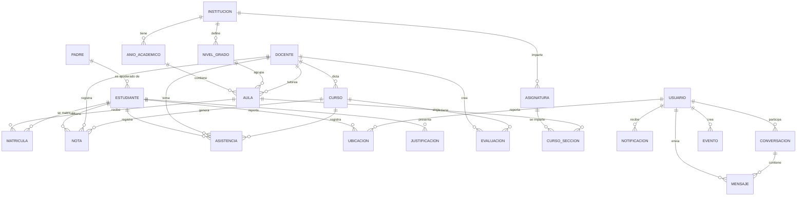

# Modelo de Datos - IEP Continental Americano - Backend Java

> Base de datos: **MongoDB** | Aplicación: Spring Boot 3.2.5 + Java 17  
> Generado a partir de los modelos Java del proyecto `sanmartin-newbackend`

---

## 1. Modelo Conceptual

Representa las entidades principales y sus relaciones sin detalles técnicos.



### Entidades Principales
| Entidad | Descripción |
|---------|-------------|
| **Institución** | IEP Continental Americano - configuracion global del colegio |
| **Año Académico** | Ciclo escolar (ej: 2025) con bimestres y fechas importantes |
| **Nivel de Grado** | 1° a 5° Primaria, 1° a 5° Secundaria |
| **Aula** | Grupo-Sección-Shift (ej: 1° Primaria A - Mañana) |
| **Estudiante** | Alumno matriculado con datos personales, médicos y académicos |
| **Docente** | Profesor con datos profesionales, contrato y certificaciones |
| **Padre** | Apoderado con preferencias de notificación y documentos |
| **Usuario** | Sistema de autenticación unificado (JWT) con roles |
| **Curso** | Asignatura dictada en un grado/sección específica |
| **Sección de Curso** | Instancia de asignatura en un aula concreta (horario, recursos) |
| **Matrícula** | Inscripción de estudiante en aula para un año académico |
| **Nota** | Registro bimestral de calificaciones por estudiante y curso |
| **Evaluación** | Prueba, tarea o proyecto dentro de un curso y bimestre |
| **Asistencia** | Registro diario de presencia/ausencia por estudiante y curso |
| **Justificación** | Solicitud de excusa por inasistencia con documentos adjuntos |
| **Evento** | Actividades, reuniones, exámenes y días festivos escolares |
| **Ubicación** | Rastreo GPS en tiempo real de estudiantes/padres |
| **Conversación** | Chat entre usuarios (directo, grupo o soporte) |
| **Mensaje** | Mensaje individual dentro de una conversación |
| **Notificación** | Alertas push/email para padres, docentes y estudiantes |

---

## 2. Modelo Lógico

Representa atributos, tipos de datos, claves e índices. En MongoDB las "tablas" son **colecciones** y las filas son **documentos JSON**.

```mermaid
erDiagram
    institutions {
        ObjectId _id PK
        string name
        string code UK
        string logo
        Address address
        string phone
        string email
        string website
        ObjectId director FK
        InstitutionEvaluationSystem evaluationSystem
        GradeScale gradeScale
        string[] shifts
        ShiftSchedules shiftSchedules
        AcademicLevels academicLevels
        int maxSectionsPerGrade
        int defaultClassroomCapacity
        string[] evaluationTypes
        EvaluationWeights defaultEvaluationWeights
        boolean isActive
        date createdAt
        date updatedAt
    }

    users {
        ObjectId _id PK
        string firstName
        string lastName
        string email UK
        string dni UK
        string password
        string phone
        string role IX
        string photo
        Address address
        boolean isActive
        boolean isVerified
        date lastLogin
        string studentProfile FK
        ChildReference[] children
        string[] permissions
        PushToken[] pushTokens
        UserSettings settings
        Coordinates lastKnownLocation
        date lastLocationUpdate
        boolean isOnline
        date lastActive
        string passwordResetToken
        date passwordResetExpires
        int loginAttempts
        date lockUntil
        date createdAt
        date updatedAt
    }

    students {
        ObjectId _id PK
        string firstName TI
        string lastName TI
        string dni UK
        string email UK
        string password
        string phone
        date birthDate
        string gender
        string photo
        Address address
        string gradeLevel
        string section
        string studentCode UK
        string enrollmentNumber UK
        Guardian[] guardians
        MedicalInfo medicalInfo
        StudentDocuments documents
        string status
        boolean isActive
        ObjectId userId FK
        date createdAt
        date updatedAt
    }

    teachers {
        ObjectId _id PK
        string firstName TI
        string lastName TI
        string dni UK
        string email UK
        string password
        string phone
        string secondaryPhone
        date birthDate
        string gender
        string photo
        Address address
        string employeeCode UK
        string specialty
        string academicDegree
        string professionalTitle
        Certification[] certifications
        string contractType
        date contractStartDate
        date contractEndDate
        double salary
        BankAccount bankAccount
        TeacherDocuments documents
        boolean isActive
        ObjectId userId FK
        ObjectId institution FK
        date createdAt
        date updatedAt
    }

    parents {
        ObjectId _id PK
        string firstName TI
        string lastName TI
        string dni UK
        string email UK
        string password
        string phone
        string secondaryPhone
        date birthDate
        string gender
        string photo
        Address address
        string occupation
        string workplace
        string workPhone
        Guardian[] children
        NotificationPreferences notifications
        ParentDocuments documents
        PushToken[] pushTokens
        boolean isActive
        boolean isVerified
        date lastLogin
        date lastActive
        boolean isOnline
        ObjectId userId FK
        string internalNotes
        date createdAt
        date updatedAt
    }

    academicyears {
        ObjectId _id PK
        ObjectId institution FK
        int year
        string name
        date startDate
        date endDate
        AcademicPeriod[] periods
        ImportantDate[] importantDates
        boolean isCurrent IX
        string status
        AcademicYearStats stats
        boolean isActive
        date createdAt
        date updatedAt
    }

    gradelevels {
        ObjectId _id PK
        ObjectId institution FK
        string name
        string shortName
        int level
        string type
        int order
        string description
        boolean isActive
        date createdAt
        date updatedAt
    }

    subjects {
        ObjectId _id PK
        ObjectId institution FK
        string name
        string code
        string description
        ObjectId[] gradeLevels FK
        string applicableTo
        int hoursPerWeek
        boolean isRequired
        string area
        EvaluationWeights defaultWeights
        Competency[] competencies
        string color
        string icon
        int order
        boolean isActive
        date createdAt
        date updatedAt
    }

    classrooms {
        ObjectId _id PK
        ObjectId gradeLevel FK
        ObjectId academicYear FK
        string section
        string shift
        ObjectId tutor FK
        int capacity
        ClassroomLocation location
        ClassroomStats stats
        boolean isActive
        date createdAt
        date updatedAt
    }

    coursesections {
        ObjectId _id PK
        ObjectId subject FK
        ObjectId classroom FK
        ObjectId teacher FK
        ObjectId academicYear FK
        Schedule[] schedule
        EvaluationWeights evaluationWeights
        PeriodEvaluation[] periodEvaluations
        CourseSectionStats stats
        Resource[] resources
        ObjectId[] students FK
        boolean isActive
        date createdAt
        date updatedAt
    }

    courses {
        ObjectId _id PK
        string name
        string code UK
        string description
        string gradeLevel
        string section
        ObjectId teacher FK
        ObjectId[] students FK
        Schedule[] schedule
        EvaluationWeights evaluationWeights
        int academicYear
        string period
        boolean isActive
        date createdAt
        date updatedAt
    }

    enrollments {
        ObjectId _id PK
        ObjectId student FK
        ObjectId classroom FK
        ObjectId academicYear FK
        date enrollmentDate
        string enrollmentNumber UK
        string status
        date statusDate
        string statusReason
        string enrollmentType
        StatusHistoryEntry[] statusHistory
        EnrollmentDocuments documents
        ObjectId previousClassroom FK
        string previousSchool
        string observations
        ObjectId enrolledBy FK
        boolean isActive
        date createdAt
        date updatedAt
    }

    grades {
        ObjectId _id PK
        ObjectId student FK
        ObjectId course FK
        int bimester
        int academicYear
        ScoreEntry[] scores
        double average
        string status
        date closedAt
        string closedBy
        date publishedAt
        ObjectId teacher FK
        date createdAt
        date updatedAt
    }

    attendances {
        ObjectId _id PK
        ObjectId student FK
        ObjectId course FK
        ObjectId teacher FK
        date date IX
        string status
        string arrivalTime
        string observations
        ObjectId justification FK
        date createdAt
        date updatedAt
    }

    evaluations {
        ObjectId _id PK
        ObjectId course FK
        ObjectId teacher FK
        string name
        string type
        int bimester
        double maxGrade
        double weight
        date date
        string description
        int academicYear
        boolean isActive
        int order
        date createdAt
        date updatedAt
    }

    events {
        ObjectId _id PK
        string title
        string date IX
        string time
        string type IX
        string description
        string location
        string participants
        boolean notifyStudents
        boolean notifyParents
        boolean notifyTeachers
        ObjectId createdBy FK
        boolean isActive IX
        date createdAt
        date updatedAt
    }

    justifications {
        ObjectId _id PK
        ObjectId student FK
        ObjectId parent FK
        date[] dates
        string reason
        string observations
        DocumentFile[] documents
        ObjectId[] coursesAffected FK
        string status IX
        ObjectId reviewedBy FK
        date reviewedAt
        string reviewNote
        date createdAt
        date updatedAt
    }

    locations {
        ObjectId _id PK
        ObjectId user FK IX
        Coordinates coordinates
        DeviceInfo deviceInfo
        string sessionStatus
        string updateType
        Address address
        double batteryLevel
        string networkType
        date clientTimestamp
        date createdAt IX
        date updatedAt
    }

    conversations {
        ObjectId _id PK
        ObjectId[] participants FK
        string type
        string name
        LastMessage lastMessage
        map unreadCount
        boolean isActive
        ConversationMetadata metadata
        date createdAt
        date updatedAt
    }

    messages {
        ObjectId _id PK
        ObjectId conversation FK
        ObjectId sender FK
        string content
        string type
        Attachment[] attachments
        ReadReceipt[] readBy
        boolean isDeleted
        date createdAt
        date updatedAt
    }

    notifications {
        ObjectId _id PK
        ObjectId recipient FK
        string title
        string message
        string type
        NotificationData data
        boolean isRead
        date readAt
        date expiresAt
        date createdAt
        date updatedAt
    }

    users ||--o{ students : "studentProfile"
    users ||--o{ teachers : "userId"
    users ||--o{ parents : "userId"
    institutions ||--o{ academicyears : "institution"
    institutions ||--o{ gradelevels : "institution"
    institutions ||--o{ subjects : "institution"
    institutions ||--o{ teachers : "institution"
    academicyears ||--o{ classrooms : "academicYear"
    academicyears ||--o{ coursesections : "academicYear"
    academicyears ||--o{ enrollments : "academicYear"
    gradelevels ||--o{ classrooms : "gradeLevel"
    gradelevels ||--o{ subjects : "gradeLevels"
    classrooms ||--o{ coursesections : "classroom"
    classrooms ||--o{ enrollments : "classroom"
    subjects ||--o{ coursesections : "subject"
    students ||--o{ enrollments : "student"
    students ||--o{ grades : "student"
    students ||--o{ attendances : "student"
    students ||--o{ justifications : "student"
    teachers ||--o{ courses : "teacher"
    teachers ||--o{ grades : "teacher"
    teachers ||--o{ attendances : "teacher"
    teachers ||--o{ evaluations : "teacher"
    teachers ||--o{ coursesections : "teacher"
    courses ||--o{ grades : "course"
    courses ||--o{ attendances : "course"
    courses ||--o{ evaluations : "course"
    parents ||--o{ justifications : "parent"
    users ||--o{ events : "createdBy"
    users ||--o{ locations : "user"
    users ||--o{ conversations : "participants"
    users ||--o{ messages : "sender"
    users ||--o{ notifications : "recipient"
    conversations ||--o{ messages : "conversation"
```

### Leyenda de Símbolos
| Símbolo | Significado |
|---------|-------------|
| `PK` | Primary Key (`_id` de MongoDB) |
| `FK` | Foreign Key (referencia ObjectId a otra colección) |
| `UK` | Unique Key (índice único) |
| `IX` | Índice simple o compuesto |
| `TI` | Text Index (búsqueda full-text) |

---

## 3. Modelo Físico

Representa la implementación exacta en MongoDB: colecciones, documentos embebidos, referencias, índices y tipos de datos nativos.

### Estrategia de Modelado Documental

| Patrón | Aplicación | Justificación |
|--------|-----------|---------------|
| **Embebido** | Address, MedicalInfo, Guardian, NotificationPreferences, ScoreEntry, Schedule | Datos de alta cohesión, consulta conjunta, baja cardinalidad |
| **Referencia** | Student↔Course, Teacher↔CourseSection, Parent↔Student | Alta cardinalidad, relaciones N:M, necesidad de independencia |
| **Array de Referencias** | `Course.students[]`, `Classroom.enrollments[]` | Relación 1:N donde el "1" necesita listar los "N" |
| **Map/Diccionario** | `Conversation.unreadCount` | Contadores por usuario con acceso O(1) |
| **Polimorfismo** | `User.role` (administrativo/docente/estudiante/padre) | Unificación de autenticación con perfiles especializados en colecciones separadas |

### Índices Clave

| Colección | Índice | Tipo | Propósito |
|-----------|--------|------|-----------|
| `users` | `{email: 1}` | Único | Login por email |
| `users` | `{dni: 1}` | Único, Sparse | Identificación nacional |
| `users` | `{role: 1, isActive: 1}` | Compuesto | Filtrado por rol |
| `students` | `{dni: 1}` | Único | Identificación del estudiante |
| `students` | `{studentCode: 1}` | Único, Sparse | Código institucional |
| `teachers` | `{employeeCode: 1}` | Único, Sparse | Código de docente |
| `classrooms` | `{gradeLevel: 1, academicYear: 1, section: 1, shift: 1}` | Único | Evitar duplicados de sección |
| `grades` | `{student: 1, course: 1, bimester: 1, academicYear: 1}` | Único | Una nota por estudiante/curso/bimestre |
| `attendances` | `{student: 1, course: 1, date: 1}` | Único | Evitar doble registro de asistencia |
| `enrollments` | `{student: 1, academicYear: 1}` | Único | Una matrícula por año |
| `messages` | `{conversation: 1, createdAt: -1}` | Compuesto | Listar mensajes de conversación ordenados |
| `locations` | `{user: 1, createdAt: -1}` | Compuesto | Última ubicación por usuario |

### Diagrama Físico (Data Modeler de MongoDB Compass)

> Abre **MongoDB Compass** → Conecta a `localhost:27017/iep_continental_db` → Selecciona la pestaña **Data Modeling** → El diagrama se generará automáticamente con las colecciones recién pobladas por el seed script.

Las colecciones ahora contienen documentos representativos de todos los modelos Java del nuevo backend:
- `users`, `students`, `teachers`, `parents`
- `institutions`, `academicyears`, `gradelevels`, `subjects`
- `classrooms`, `coursesections`, `courses`, `enrollments`
- `grades`, `attendances`, `evaluations`, `events`
- `justifications`, `locations`
- `conversations`, `messages`, `notifications`

---

## Archivos Generados

| Archivo | Descripción |
|---------|-------------|
| `seed_newbackend.js` | Script para poblar MongoDB con datos de prueba del nuevo backend |
| `modelo_datos_sanmartin.md` | Este documento con los 3 modelos en Mermaid |

### Instrucciones para regenerar el diagrama en MongoDB Compass

1. Asegúrate de que MongoDB esté corriendo (`mongod`)
2. Ejecuta el seed:
   ```bash
   mongosh localhost:27017/iep_continental_db seed_newbackend.js
   ```
3. Abre **MongoDB Compass**
4. Conecta a `mongodb://localhost:27017/iep_continental_db`
5. En el panel izquierdo, haz clic en **Data Modeling**
6. Selecciona la conexión `localhost:27017/iep_continental_db`
7. Compass generará automáticamente el diagrama de entidades con campos, tipos y relaciones basado en los documentos insertados

